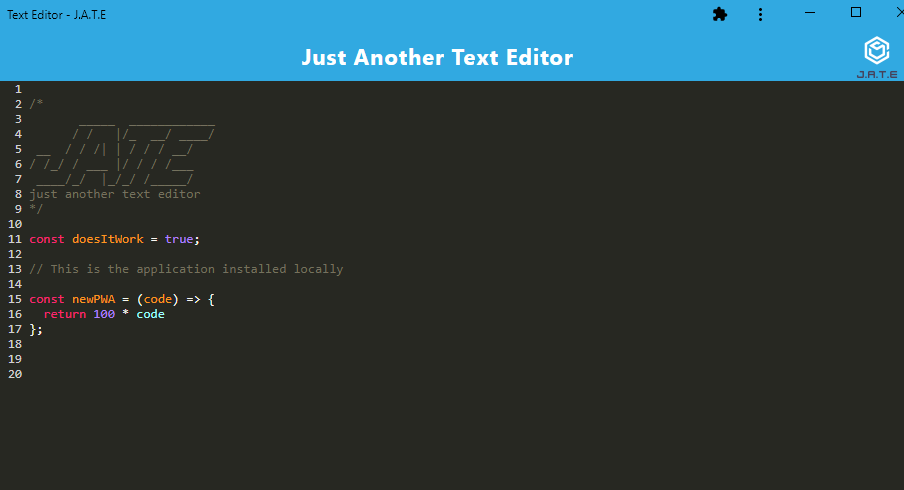

# pwa-text-editor

## Description
This application is a browser-based Text Editor written and deployed as a progressive web application (PWA) that can be installed on the user's local machine. The editor leverages **CodeMirror** to style, color and highlight syntax to help with the readibility. The application uses a Service Worker for asset caching and Data is saved to indexedDB with localStorage as a fallback for persistence and to allow the app to function while offline. 

<strong>Table of Contents</strong>

- [Installation](#installation)
- [Usage](#usage)
- [License](#license)
- [Contributing Guidelines](#contributing-guidelines)
- [Tests](#tests)
- [Languages, Skills and Credits](#languages-skills-and-credits)
- [Screenshots](#screenshots)
- [Questions and Links](#questions-and-links)
- [Details and Learnings](#details-and-learnings)

## Installation
### Local Installation
- Clone the repo.
- Navigate to the folder and run `npm init` followed by `npm install` in order to install the dependencies.
- Use the command `npm run start` to start the server.
- The server is pointed to http://localhost:3000/.
- Once running, the application can be installed on the local machine by clicking the install button and following the prompts.

## Usage
The Text Editor works by accepting any text as input, and then saving all input as a string each time the editor (browser window) loses focus. When the application is launched or refreshed, the latest data is rendered to the screen. 

## License
Distributed under the **MIT** license.

## Contributing Guidelines
Contributions help our open source community to continue to evolve, and any contributions are greatly appreciated. If you have a suggestion that would improve this code please follow the directions below. I require that any and all changes adhere to the Code of Conduct outlined in the [Contributor Covenant](https://www.contributor-covenant.org/).

 - Fork the repo
 - Create your feature branch
 - Commit your changes
 - Push the branch and open a pull request

> _**Note:** Any contributions are understood to be under the same MIT that covers the project. If this is a concern please contact me._

## Tests
There are currently no tests written for this application.

## Languages, Skills and Credits
- JavaScript
- Node.js
- Dependencies:
    - [express](https://www.npmjs.com/package/express) as a web framework for Node.js.
    - [concurrently](https://www.npmjs.com/package/concurrently) enables multiple command line scripts to be executed at once
    - [webpack](https://www.npmjs.com/package/webpack) the application pulls in webpack as a bundler and multiple supporting modules such as:
        - babel: For transpiling and ES6 backwards compatibility 
        - html-webpack-plugin: For generation of a client side index.html file with relative links to scripts and styles
        - css-loader and style-loader: For bundling CSS with JS
        - webpack-pwa-manifest: For creation of the PWA manifest file
        - workbox-webpack-plugin: For Service Worker functionality to cache assets 

## Screenshots
here is a screenshot of the application installed locally

## Questions and Links
Please reach out with any questions regarding the application.

View the deployed application on [Heroku](https://text-editor-tl.herokuapp.com/)

View the repository in [GitHub](https://github.com/benfok/pwa-text-editor)

## Details and Learnings
- This was a challenging application to build as while the dependencies helped make some code syntax simplier, they made troubleshooting much more difficult.
- On initial load the application first checks for existing data within IndexedDB, then localStorage and then if neither, displays the default header artwork.
- Images, the home page, scripts and styles are cached to improve performance and for offline use. 
- Added css rules to remove the Install button if the application was being viewed in `display: standalone` (i.e. installed) and also to override the default CodeMirror wondow sizing to ensure the viewable code window takes up the full viewport height.
 

